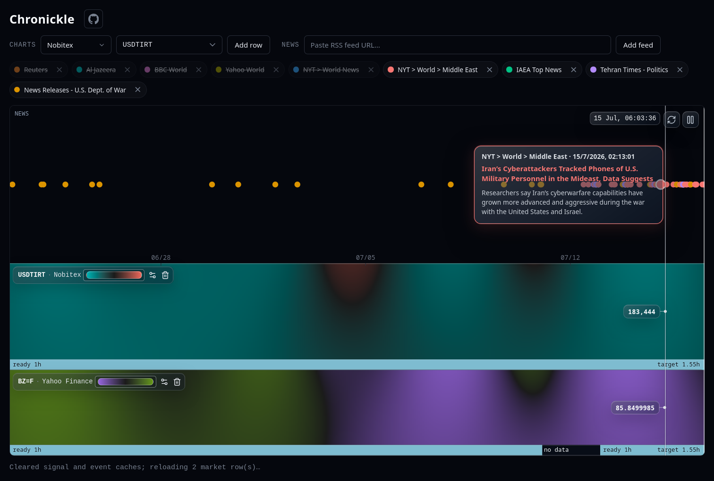

# chronickle


Browser-based SPA that correlates multi-source market growth with real-world news events on a scrubbable timeline.

Live: **<https://khoda81.github.io/chronickle/>**

## Tech Stack

- **Language:** TypeScript (strict, `noUncheckedIndexedAccess`)
- **Runtime/Bundler:** Bun + Vite
- **UI:** SolidJS for application UI and persisted state; a framework-independent custom `<canvas>` renderer for the timeline.

## Develop

```sh
bun install
bun run dev        # vite dev server (HMR)
bun run test       # numerical and data-structure invariants
bun run build      # tsc -b && vite build -> dist/
bun run typecheck  # tsc --noEmit
bun run preview    # serve dist/ locally
```

Each market row owns a price broker, while one timeline stacks a resizable news row above all price heatmaps and draws a single shared time axis between them.

The price broker is a cache facade. A viewport subscription describes the minimum time range and native sample cadence currently needed; reads never start network work. One long-lived adapter session receives all current demands and owns resolution selection, request expansion, cancellation, retry/backoff, and live polling or sockets. An adapter may search and deliver a wider range than requested, and the broker caches the complete delivery.

Each signal status strip has two independent layers. The thin data layer is a per-screen-pixel sample-density tone: zero means no observations in that time bin and one means the bin meets or exceeds the requested cadence. The request layer reports only what acquisition is doing: `pending` includes both queued and currently executing work, while `retrying` adds the attempt, source error, and countdown. The adapter retains its private executing-versus-queued distinction to serialize work, but it is deliberately not part of the broker's public state.

The generic polling adapter uses a bounded, latest-demand-aware work lane and one warm live lease. Small gaps are expanded to an exchange-appropriate minimum point count, and a live lease is retained briefly after leaving follow mode to avoid unnecessary reconnects. Reload clears both broker observations and adapter scheduling evidence; late aborted deliveries are ignored.

The market picker loads active Binance and Nobitex symbols into a filterable autocomplete while preserving free-form entry. Yahoo Finance supports futures and other symbols, including `CL=F` (WTI crude) and `BZ=F` (Brent crude).
